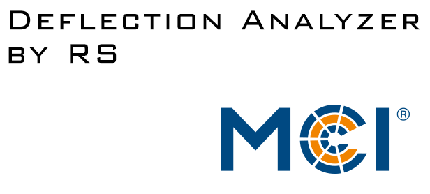

<!--
*** Thanks for checking out the Best-README-Template. If you have a suggestion
*** that would make this better, please fork the repo and create a pull request
*** or simply open an issue with the tag "enhancement".
*** Thanks again! Now go create something AMAZING! :D

***
***
***
*** To avoid retyping too much info. Do a search and replace for the following:
*** MechResato, DeflectionAnalyzer, twitter_handle, email, project_title, project_description
-->

<!-- PROJECT SHIELDS -->
<!--
*** I'm using markdown "reference style" links for readability.
*** Reference links are enclosed in brackets [ ] instead of parentheses ( ).
*** See the bottom of this document for the declaration of the reference variables
*** for contributors-url, forks-url, etc. This is an optional, concise syntax you may use.
*** https://www.markdownguide.org/basic-syntax/#reference-style-links
-->
[![Contributors][contributors-shield]][contributors-url]
[![Forks][forks-shield]][forks-url]
[![Stargazers][stars-shield]][stars-url]
[![Issues][issues-shield]][issues-url]
[![MIT License][license-shield]][license-url]

<!-- PROJECT LOGO -->
 

  

  <h3 align="center"></h3>

  

    A XMC microcontroller based platform for analysis and interpretation of sensors focused on motorcycle suspensions
     
    <a href="https://github.com/MechResato/DeflectionAnalyzer"><strong>Explore the docs »</strong></a>
     
     
    <a href="https://github.com/MechResato/DeflectionAnalyzer">View Demo</a>
    ·
    <a href="https://github.com/MechResato/DeflectionAnalyzer/issues">Report Bug</a>
    ·
    <a href="https://github.com/MechResato/DeflectionAnalyzer/issues">Request Feature</a>
  

<!-- TABLE OF CONTENTS -->

  
<h2 style="display: inline-block">Table of Contents</h2>

  <ol>
    <li>
      <a href="#about-the-project">About The Project</a>
      <ul>
        <li><a href="#motivation">Motivation</a></li>
		<li><a href="#hardware">Hardware</a></li>
      </ul>
    </li>
    <li><a href="#getting-started">Getting Started</a></li>
    <li><a href="#license">License</a></li>
    <li><a href="#contact">Contact</a></li>
    <li><a href="#acknowledgements-and-resources">Acknowledgements and Resources</a></li>
  </ol>

<!-- ABOUT THE PROJECT -->

## About The Project

[![Product Name Screen Shot][product-screenshot]](https://github.com/MechResato/DeflectionAnalyzer/images)

### Motivation

The currently here growing project acts as a storage for a theses and is still under construction (estimated finalization May 2021). The main goals of the project are:
* [Design of an detachable Platform used to analyze motorcycle suspensions]
* [Highly modular code structure to be reused in various situations]
* [Creation of an reusable embedded system platform with sensor/bus input (CAN, I2C, SPI, 0-10V, ...) as well as output via TFT and logging on an SD-Card]

### Hardware
* [Microcontroller Board: Infineon XMC4700 Relax Kit](https://www.infineon.com/cms/de/product/evaluation-boards/kit_xmc47_relax_v1/)
* [Display: Riverdi RiTFT-43-CAP-UX](https://riverdi.com/product/ritft43capux/)
* [Mainboard: Custom]()

<!-- GETTING STARTED -->
## Getting Started

The firmware is written using [Infineon DAVE 4.4.2](https://infineoncommunity.com/dave-download_ID645). It is meant to be used with an Infineon XMC4700 Relax Kit (Version with assembled SD-Card mount, CAN transceiver and RTC) as microcontroller and a RiTFT-43-CAP-UX (4.3″ 480x272px TFT with capacitive touchscreen and BT81x Embedded Video Engine (EVE) coprocessor from Riverdi). The used (custom) mainboard is not necessary, but in this case the connections must be done according to following figure:

[![Main schematics of the main board][pinout]](https://github.com/MechResato/DeflectionAnalyzer/images)

Note that the pinout of the TFT connector was designed to use an inverted flat cable (type B). If you use an Breakout board (like this [ZIF-20 Adapter](https://www.robotshop.com/de/de/riverdi-breakout-board-zif-20-zu-idc-20.html)) the pinout might be inverted (20 ->1 instead of 1->20).

<!-- USAGE EXAMPLES -->

<!--## Usage -->

<!-- Use this space to show useful examples of how a project can be used. Additional screenshots, code examples and demos work well in this space. You may also link to more resources.

_For more examples, please refer to the [Documentation](https://example.com)_-->

<!-- ROADMAP -->
<!-- ## Roadmap -->

 <!--See the [open issues](https://github.com/MechResato/DeflectionAnalyzer/issues) for a list of proposed features (and known issues).--> 

<!-- CONTRIBUTING -->

<!-- ## Contributing -->

<!-- Contributions are what make the open source community such an amazing place to be learn, inspire, and create. Any contributions you make are **greatly appreciated**.

1. Fork the Project
2. Create your Feature Branch (`git checkout -b feature/AmazingFeature`)
3. Commit your Changes (`git commit -m 'Add some AmazingFeature'`)
4. Push to the Branch (`git push origin feature/AmazingFeature`)
5. Open a Pull Request -->

<!-- LICENSE -->
## License

Distributed under the MIT License. See `LICENSE` for more information.

<!-- CONTACT -->
## Contact

<!-- Your Name - [@twitter_handle](https://twitter.com/twitter_handle) - email -->

Project Link: [https://github.com/MechResato/DeflectionAnalyzer](https://github.com/MechResato/DeflectionAnalyzer)

<!-- ACKNOWLEDGEMENTS & RESOURCES -->
## Acknowledgements and Resources

* [RudolphRiedel - FT800-FT813](https://github.com/RudolphRiedel/FT800-FT813)
* [Nate Domin - polyfit](https://github.com/natedomin/polyfit)
* [othneildrew - Best-README-Template](https://github.com/othneildrew/Best-README-Template)
* Stefan Reinmüller - For contribution while implementing the TFT Library and the design of the custom mainboard

<!-- MARKDOWN LINKS & IMAGES -->
<!-- https://www.markdownguide.org/basic-syntax/#reference-style-links -->
[contributors-shield]: https://img.shields.io/github/contributors/MechResato/DeflectionAnalyzer.svg?style=for-the-badge
[contributors-url]: https://github.com/MechResato/DeflectionAnalyzer/graphs/contributors
[forks-shield]: https://img.shields.io/github/forks/MechResato/DeflectionAnalyzer.svg?style=for-the-badge
[forks-url]: https://github.com/MechResato/DeflectionAnalyzer/network/members
[stars-shield]: https://img.shields.io/github/stars/MechResato/DeflectionAnalyzer.svg?style=for-the-badge
[stars-url]: https://github.com/MechResato/DeflectionAnalyzer/stargazers
[issues-shield]: https://img.shields.io/github/issues/MechResato/DeflectionAnalyzer.svg?style=for-the-badge
[issues-url]: https://github.com/MechResato/DeflectionAnalyzer/issues
[license-shield]: https://img.shields.io/github/license/MechResato/DeflectionAnalyzer.svg?style=for-the-badge
[license-url]: https://github.com/MechResato/DeflectionAnalyzer/blob/master/LICENSE.txt
[product-screenshot]: images/overview.jpg
[pinout]: images/pinout.png
